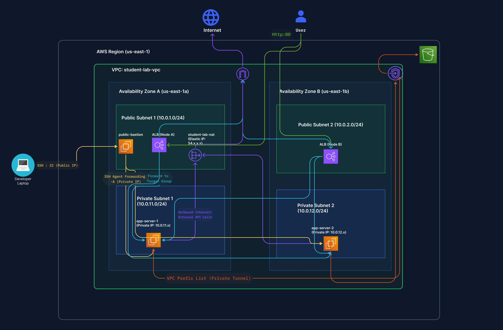
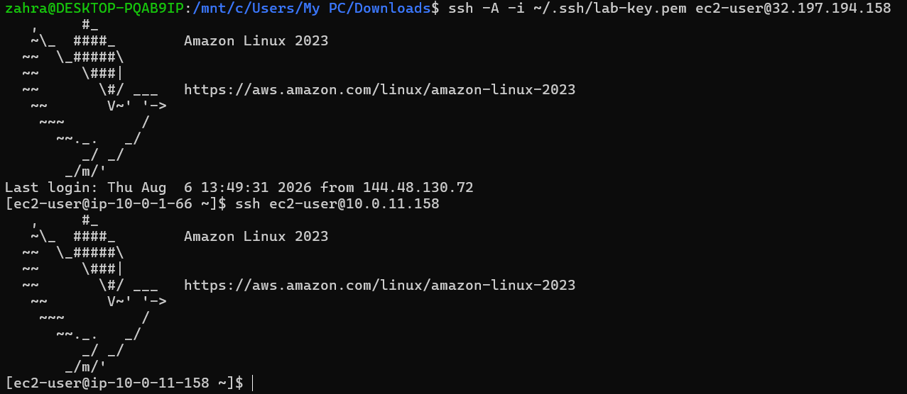
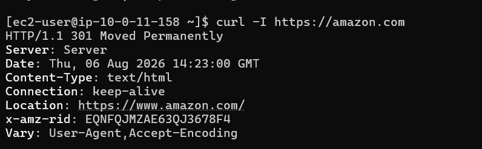
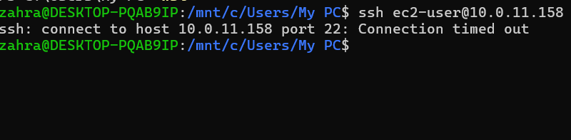
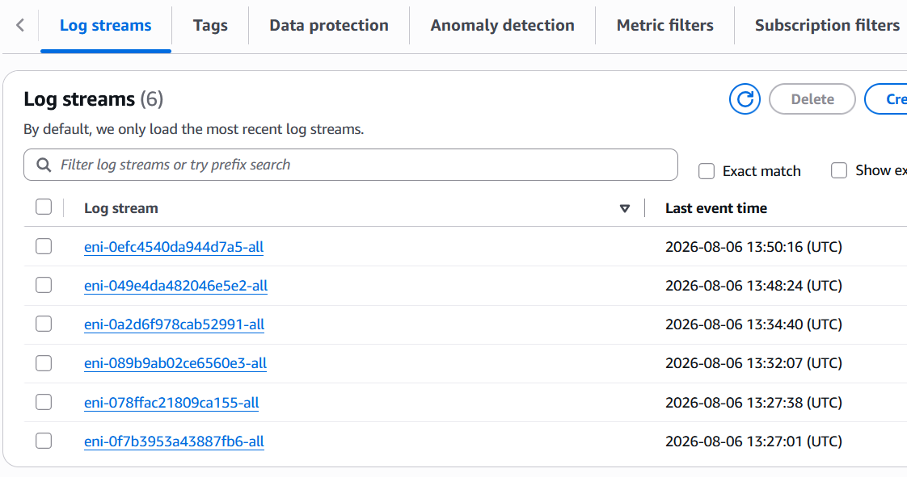

# Production-Grade Multi-AZ AWS VPC (Infrastructure as Code)

An automated, highly available, and secure multi-tier AWS network architecture built using **Terraform (HCL)**.

---

## Architecture Overview



### Short Design Overview
* **Multi-AZ Layout:** Deployed across 2 AWS Availability Zones (`us-east-1a` / `us-east-1b`) for high availability.
* **Subnet Segmentation:** 
  * **Public Subnets:** Host the Application Load Balancer (ALB) and Bastion Jump Host.
  * **Private Subnets:** Host isolated backend application instances with no direct public IP addresses.
* **Security Layering:** Strict ingress/egress boundaries enforced via Network Access Control Lists (NACLs) and Security Groups.
* **Infrastructure as Code (IaC):** Complete life cycle management and provisioning using Terraform.

---

## Verification & Test 

### 1. Application Load Balancer (ALB) Traffic Balancing
.png)

### 2. Bastion Host Jump Test


### 3. Private Subnet Outbound Egress (NAT Gateway)


### 4. Direct Public Inbound Isolation Test


### 5. VPC Flow Logs & S3 Gateway Endpoint Validation


---

## How to Deploy

### Prerequisites
* [Terraform CLI](https://www.terraform.io/downloads) (v1.0+) installed
* [AWS CLI](https://aws.amazon.com/cli/) configured with active credentials

### Deployment Steps

1. **Clone the repository:**
```bash
git clone [https://github.com/YOUR_USERNAME/aws-multiaz-vpc-capstone.git](https://github.com/YOUR_USERNAME/aws-multiaz-vpc-capstone.git)
cd aws-multiaz-vpc-capstone/terraform
```

2. **Initialize Terraform:**
```bash
terraform init
```

3. **Validate & Plan:**
```bash
terraform validate
terraform plan
```

4. **Apply configuration:**
```bash
terraform apply
```

5. **Clean up resources:**
```bash
terraform destroy
```